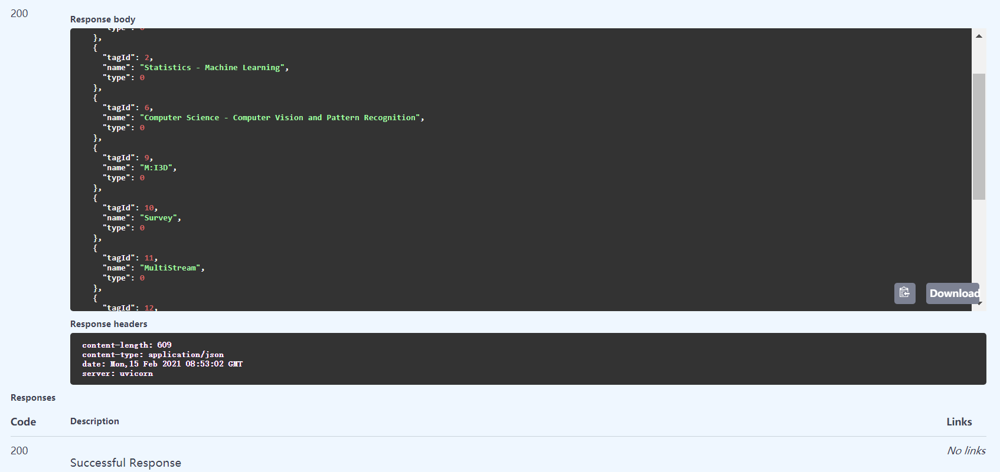

# pyzotero-local

A Python tool kit for interacting with the locally hosted Zotero database.

# Features
 - Well-designed api with typehint, very easy to use.
 - All path will be located automatically, no need to assign it manually.


# Install
```shell script
pip install zolocal
```
 
 
# Usage

## access dataset
access zotero local database and query values
```python
from pprint import pprint
from pyzolocal.sqls import gets as g

pprint(g.get_attachments()[:3])
pprint(g.get_items_info()[:3])
    # more get function including tag/ collection/ creator/ type
```

## read profile
get profile root and profiles (from [this](https://www.zotero.org/support/kb/profile_directory))
```python
from pprint import pprint
from pyzolocal.prefs import prefjs_fn
from pyzolocal.prefs.gets import (get_and_parse_user_prefs,
                                  search_user_prefs,
                                  get_and_parse_user_pref)
from pyzolocal.prefs.common import dataDir

pprint(dataDir())
pprint(prefjs_fn())
pprint(get_and_parse_user_prefs())

# =============================
\path\to\dataDir
\path\to\prefs.js
{'app.update.download.attempts': 0,
 'app.update.elevate.attempts': 0,
 'app.update.lastUpdateTime.addon-background-update-timer': 1613312615,
    ...}
```

## sync profile
compress your user Profile
```python
from pyzolocal.sync.base import bundle,dump

bundle('./')
dump('./Profiles.zip',...)
```


## global search
index and global search files (supported by [whoosh](https://github.com/mchaput/whoosh))

> you need to install whoosh manually by `pip install whoosh`

```python
from pprint import pprint
from pyzolocal.files import index, search

index() # run once when attahed file updated
res = search('my file')
pprint(res)


# ========================
{'base': {'doc_count': 42, 'hit_count': 5, 'result_count': 5},
 'result': [{'contents': ['training and validation). However, 15 of 457 videos '
                          'are invalid (<b class="match term0">file</b> '
                          'corrupted or have no transcript), so we move 15 '
                          'videos from the development set to the testing'],
             'path': 'storage\\AAZW6H2B\\... .pdf',
             'title': 'Learning Semantic Concepts and Temporal Alignment'},
...}
```  


## web api for local database
**by fastapi**
 ```python
from pyzolocal.apis.fastapi import get_fastapis

app = get_fastapis()
```
then start it by uvicorn or other asgi framework.

> see [fastapi_demo](./examples/fastapi_demo.py)




 - [ ] flask


# TODOs
 - [ ] compatible with MacOS and Linux
 - [ ] more synchronize function
 - [ ] pyqt5 wrapper

# Development

```shell script
git clone https://github.com/sailist/pyzotero-local
cd pyzotero-local
python setup.py sdist bdist_wheel
```

## file structure
```
pyzolocal
│
├─apis
│  │  base.py # for locally web api
│  │  fastapi.py # TODO
│  └─ flask.py  # TODO
│
├─beans  # data structure
│  │  enum.py
│  │  struct.py
│  └─ types.py
│
├─files  # for global search
│  │  base.py
│  └─ gets.py
│
├─prefs  # for reading profiles 
│  │  base.py
│  │  common.py
│  └─ gets.py
│
├─sqls  # for accessing database 
│  │  base.py 
│  └─ gets.py
│
└─sync  # for back-up
   │  base.py
   │  bypy.py # TODO
   │  ftp.py  # TODO 
   └─ gists.py # TODO
```


# License
 
 [GNU](./LICENSE) © Haozhe Yang
 
  
# Related repos

 - [qnotero](https://github.com/ealbiter/qnotero), Standalone sidekick to the Zotero reference manager
 - [pyzotero](https://github.com/urschrei/pyzotero), A Python client for the Zotero Web API